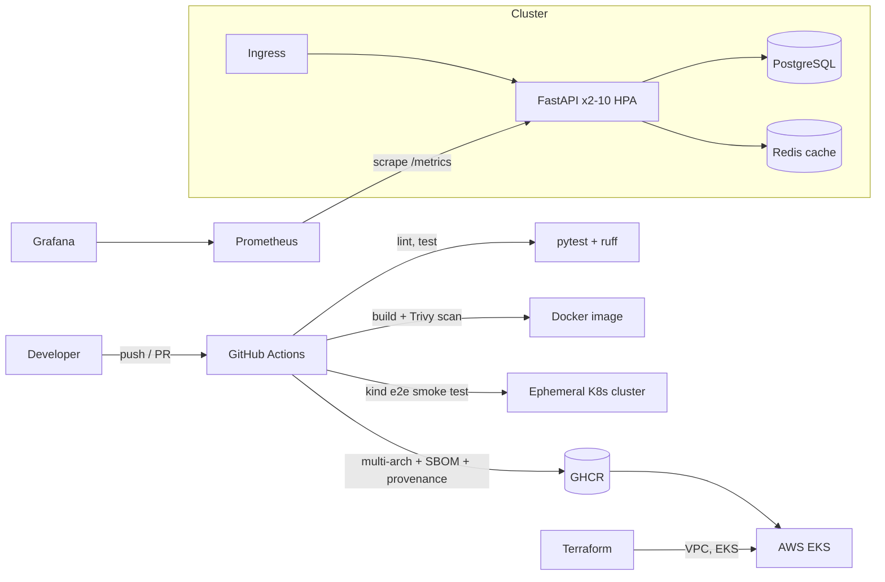

# urlshort-platform


A production-style **URL shortener** built to demonstrate an end-to-end DevOps workflow: containerization, CI/CD with security gates, Kubernetes deployment, infrastructure as code, and observability.

> The app is intentionally small. The point of the project is the **platform around it**.

## Architecture



## What's inside

| Area | Implementation |
|---|---|
| App | FastAPI, Postgres storage, Redis cache that **fails open**, structured JSON logs |
| Containers | Multi-stage Dockerfile, non-root user, healthcheck, pinned deps |
| Local env | `docker compose` with app, Postgres, Redis, Prometheus, Grafana (auto-provisioned dashboard) |
| CI/CD | Lint, tests, Terraform validate, Trivy (image + IaC), **kind end-to-end test**, multi-arch push to GHCR, SBOM + signed provenance attestation |
| Kubernetes | Kustomize; rolling updates with zero unavailable, liveness/readiness/startup probes, HPA, PDB, NetworkPolicy, resource limits, read-only root FS, dropped capabilities |
| IaC | Terraform: VPC (2 AZ), EKS managed node group |
| Observability | RED metrics (rate, errors, duration), low-cardinality route labels, cache hit ratio, business metric (`links_created_total`) |
| Testing pyramid | Unit tests, **integration tests against real Postgres + Redis** (CI service containers), **k6 load test** with pass/fail thresholds (p95 < 400ms, errors < 1%), end-to-end smoke test on kind |
| Alerting | Prometheus rules (AppDown, 5xx > 2%, p95 > 500ms, low cache hit ratio) validated with `promtool` in CI |
| Cloud security | **GitHub OIDC -> AWS** (no stored keys, trust limited to this repo), Checkov + Trivy IaC scans, encrypted/versioned remote state with locking |
| Delivery | `terraform plan` posted on PRs; manual **Deploy to EKS** workflow gated by a protected environment, with **automatic rollback** and post-deploy smoke test |
| Supply chain | Dependabot for pip, Docker, Actions, Terraform |

## Quick start (local)

```bash
make up          # builds and starts everything
make load        # generate traffic
```
- API: http://localhost:8000/docs
- Grafana: http://localhost:3000 (dashboard "URL Shortener")
- Prometheus: http://localhost:9090

```bash
curl -X POST localhost:8000/api/v1/links -H 'content-type: application/json' -d '{"url":"https://github.com"}'
curl -i localhost:8000/<code>
curl localhost:8000/api/v1/links/<code>/stats
```

## Run on Kubernetes locally (kind)

```bash
make kind-up kind-deploy
kubectl -n urlshort get pods
kubectl -n urlshort port-forward svc/urlshort 8080:80
```

## Deploy to AWS (costs money, ~$0.15/hr NAT+EKS+nodes; destroy afterwards)

```bash
# 1. (optional, once) remote state backend
cd terraform/bootstrap && terraform init && terraform apply
# then uncomment the backend "s3" block in terraform/versions.tf with the bucket name

# 2. infrastructure (VPC, EKS, GitHub OIDC role)
cd ../ && cp example.tfvars my.tfvars   # edit github_repo
terraform init && terraform apply -var-file=my.tfvars
terraform output github_actions_role_arn
```

3. In GitHub: **Settings -> Secrets and variables -> Actions -> Variables**, add `AWS_ROLE_ARN` (from the output above) and optionally `AWS_REGION`, `EKS_CLUSTER`.
4. **Settings -> Environments -> New: `production`** and add yourself as a required reviewer.
5. **Actions -> Deploy to EKS -> Run workflow** with an image tag (e.g. `latest`). It applies the manifests, waits for the rollout, and rolls back automatically on failure.
   *Note: Images are published to GHCR. EKS needs the GHCR package to be set to public in GitHub package settings, or you must configure an imagePullSecret.*
6. `terraform destroy -var-file=my.tfvars` when finished.

Load test locally: `docker run --rm --network host -v $PWD/scripts:/scripts grafana/k6 run /scripts/loadtest.js`

## Design decisions

- **Redis fails open.** Cache outages degrade latency, not availability. `/readyz` reports `cache: degraded` without failing.
- **Liveness vs readiness split.** `/healthz` never touches dependencies (avoids restart storms); `/readyz` checks the DB.
- **Metrics use route templates**, not raw paths, to avoid unbounded Prometheus cardinality.
- **CI e2e on kind** catches broken manifests, which unit tests can't.
- **Secrets in `config.yaml` are demo-only.** Production should use External Secrets Operator or Sealed Secrets.

## Known limitations / roadmap

- [ ] Argo CD for GitOps-based delivery
- [ ] Postgres via managed RDS instead of in-cluster StatefulSet
- [ ] Alertmanager routing (Slack/PagerDuty); alert *rules* already exist in `monitoring/alerts.yml`
- [ ] cert-manager + TLS on the Ingress
- [ ] Remote Terraform state (S3 + DynamoDB), backend block is stubbed in `versions.tf`
